<picture>
  <source media="(prefers-color-scheme: dark)" srcset="./profile/stats.svg">
  
</picture>
<picture>
  <source media="(prefers-color-scheme: dark)" srcset="./profile/top-langs.svg">
  
</picture>

SVG credits to https://github.com/sindresorhus/css-in-readme-like-wat
